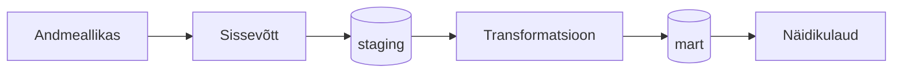

# [GRUPI NIMI] — VIIMASE_NÄDALA_MAAVÄRINATE_ÜLEVAADE

> **Juhend:** Asenda kõik nurksulgudes vormid oma sisuga enne esitamist. Kustuta see juhendrida.

## Äriküsimus

[Kirjelda ühe-kahe lausega, millise andmetega seotud probleemi te lahendate ja kes sellest kasu saab.]

Meie eesmärk on koondada maavärinaandmed ühtsesse ülevaatesse, mis toetab teadlasi, kriisijuhtimist ja avalikkust ajakohase ohutaseme hindamisel ning varajase hoiatamise võimaluste parandamisel.

**Mõõdikud:**

1. Maavärinate arv viimasel nädalal
2. Maavärinate tugevus viimasel nädalal
3. Maavärinate asukoht viimasel nädalal

## Arhitektuur



Täpsem kirjeldus: [`docs/arhitektuur.md`](docs/arhitektuur.md)

## Andmestik

| Allikas | Tüüp | Ajas muutuv? | Roll |
|---------|------|--------------|------|
| USGS Earthquake | API | Jah, osaliselt iga minut | Põhiandmevoog |
| [Earthquake Track] | [seed / dim-tabel] | Ei, staatiline | Kõrvaltabel |

## Stack

| Komponent | Tööriist |
|-----------|---------|
| Sissevõtt | Python | 
| Transformatsioon | SQL, vajadusel dbt | 
| Andmehoidla | PostgreSQL (DuckDB kasutasime ühenduse testimiseks) |
| Näidikulaud | [Superset / Streamlit / muu] |
| Orkestreerimine | [Airflow / cron / muu] |

## Käivitamine

```bash
# 1. Klooni repo ja liigu kausta
git clone <repo-url>
cd <projekti-kaust>

git clone https://github.com/MSocius/maavarinate-ulevaade-pss-ut-andmeinseneeria-2026
cd maavarinate-ulevaade-pss-ut-andmeinseneeria-2026
git pull


# 2. Kopeeri keskkonnamuutujad
cp .env.example .env
# Muuda .env failis paroolid ja muud seaded vastavalt vajadusele
.env.example .env - on hetkel ka maavärinate spetsiifilised andmed, siis tulevad need "git pull" abil oma pc-sse
.env - ei tohi jõuda reposse.

# 3. Käivita teenused
docker compose up -d --build

MS - mina kasutan CMD
git pull - tõmbab repo uuendused oma pc-sse
pip install duckdb - paigaldab andmebaasi. Võiks paigaldada prosgre selle asemel
python ingest_usgs.py - kood leiab env failist muutujad ja salvestab ducdb andmebaasi

# 4. [Vabatahtlik: käivita sissevõtt käsitsi esimesel korral]
# docker compose exec pipeline python scripts/run_pipeline.py run-all
```

Airflow (kui kasutatakse): http://localhost:8080 (kasutaja: airflow / parool: airflow)
Näidikulaud: http://localhost:[PORT]

## Saladused ja konfiguratsioon

Kõik saladused (paroolid, API võtmed, andmebaasi URL-id) on `.env` failis. Repos on ainult `.env.example`, mis näitab vajalike muutujate struktuuri ilma tegelike väärtusteta. Päris `.env` faili ei tohi GitHubi panna - see on `.gitignore`-s.

Vajalikud muutujad:

| Muutuja | Tähendus | Näide |
|---------|----------|-------|
| `USGS_URL` | andmete asukoht | https://earthquake.usgs.gov/fdsnws/event/1/query) |
| `POSTGRES_USER` | db kasutaja | meiegrupp |
| `POSTGRES_PASSWORD` | parool | meieparool |
| `POSTGRES_DB` | db nimi | MAAVARIN_PG|
| `DB_PORT_HOST` | port | 55432 |
| `...` |  ... | ... |


## Andmevoog lühidalt

1. **Sissevõtt** —  Py script ingest_usgs.py kraabib USGS API-st toorandmed. API lingi ja paroolid on env failis.
2. **Laadimine** —  Andmed laetakse PostgreSQL andmebaasi (andmete kättesaadavust testisime ka DuckDB-ga). 
3. **Transformatsioon** — Magnituudi kategooriad:mikro — magnituud alla <2, väike 2 .. 4, mõõdukas = 4 .. 6, tugev = 6 .. 7, väga tugev st üle 7. Päeva kokkuvõte: piirkond ja magnituud vähemalt 4   [Kirjelda peamised arvutused ja mudelid] 
6. **Testimine** — [Mitu] andmekvaliteedi testi kontrollivad korrektsust = 
7. **Näidikulaud** — [Kirjelda lühidalt, mida näidikulaud näitab] = Võiks näidata maavärinate asukohti ja sagedusi.

## Andmekvaliteedi testid

Projekt kontrollib järgmist:

1.Kas maavärina registreering on db-s unikaalne.
2. 
[Test 1 - nt: kasutajate ID on unikaalne] =
4. [Test 2 - nt: tellimuse summa pole null] = 
5. [Test 3 - nt: kuupäev jääb vahemikku 2020-2026]
[Lisa rohkem, kui sul on]

Testide tulemused: [kuhu salvestatakse / kuidas vaadata]

## Projekti struktuur

```
.
├── README.md
├── compose.yml
├── .env.example
├── .gitignore
├── docs/
│   ├── arhitektuur.md      ← nädal 1 väljund
│   └── progress.md         ← nädal 2 väljund
└── ...                     ← ülejäänud projektifailid
```

## Kokkuvõte, puudused ja võimalikud edasiarendused

**Kokkuvõte:**
- [Loetle, mis on lõpule viidud, mis töötab hästi]
- GitHub-i Codespaces ja pc CMD`s töötab paralleeleselt. 
- Andmete laadimine andmebaasi töötab.
- 

**Puudused:**
- [Loetle ausalt, mis jäi tegemata - see ei mõjuta hinnet negatiivselt, vaid aitab hinnata]
- Süsteemide loogika ja seadistustega on veel vaja katsetada. GitHubi Codespaces ei ole piisavat töökindlust. 
- Seadistused on algajale keerulised. Peamiselt kasutades Windowsi, siis hetkel on palju detaile mis takistavad ja tekitavad segadust. Selle loogikaga vaja veel harjuda. 
- 

**Mis edasi:**
- [Mida tahaksid edasi teha, kui aega oleks rohkem]
- Andmeallikaid oleks juurde vaja integreerida.

## Meeskond

| Nimi | Roll |
|------|------|
| Ingrid Puusta-Rickard | arhitektuur |
| Katre Seema | [Roll] |
| Margus Soots | andmeallika, transformatsioonide, näidikulaua omanik |
