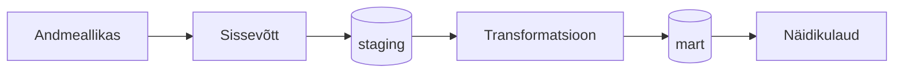

# [GRUPI NIMI] — VIIMASE_NÄDALA_MAAVÄRINATE_ÜLEVAADE

> **Juhend:** Asenda kõik nurksulgudes vormid oma sisuga enne esitamist. Kustuta see juhendrida.

## Äriküsimus

[Kirjelda ühe-kahe lausega, millise andmetega seotud probleemi te lahendate ja kes sellest kasu saab.]

Meie eesmärk on koondada maavärinaandmed ühtsesse ülevaatesse, mis toetab teadlasi, kriisijuhtimist ja avalikkust ajakohase ohutaseme hindamisel ning varajase hoiatamise võimaluste parandamisel.

**Mõõdikud:**

1. [Esimene KPI või mõõdik — näiteks: maavärinate arv viimasel nädalal]
2. [Teine KPI või mõõdik - maavärinate tugevus viimasel nädalal]
3. [Kolmas KPI või mõõdik — maavärinate asukoht viimasel nädalal]

## Arhitektuur



Täpsem kirjeldus: [`docs/arhitektuur.md`](docs/arhitektuur.md)

## Andmestik

| Allikas | Tüüp | Ajas muutuv? | Roll |
|---------|------|--------------|------|
| [USGS Earthquake] | [API / fail / andmebaas] | Jah, [iga minut] | Põhiandmevoog |
| [Earthquake Track] | [seed / dim-tabel] | Ei, staatiline | Kõrvaltabel |

## Stack

| Komponent | Tööriist |
|-----------|---------|
| Sissevõtt | [Python / Airflow / muu]  Python "ingest_usgs,py" abil | 
| Transformatsioon | [SQL / dbt / muu] | 
| Andmehoidla | PostgreSQL |
| Näidikulaud | [Superset / Streamlit / muu] |
| Orkestreerimine | [Airflow / cron / muu] |

## Käivitamine

```bash
# 1. Klooni repo ja liigu kausta
git clone <repo-url>
cd <projekti-kaust>

git clone https://github.com/MSocius/maavarinate-ulevaade-pss-ut-andmeinseneeria-2026
cd maavarinate-ulevaade-pss-ut-andmeinseneeria-2026


# 2. Kopeeri keskkonnamuutujad
cp .env.example .env
# Muuda .env failis paroolid ja muud seaded vastavalt vajadusele

# 3. Käivita teenused
docker compose up -d --build

# 4. [Vabatahtlik: käivita sissevõtt käsitsi esimesel korral]
# docker compose exec pipeline python scripts/run_pipeline.py run-all
```

Airflow (kui kasutatakse): http://localhost:8080 (kasutaja: airflow / parool: airflow)
Näidikulaud: http://localhost:[PORT]

## Saladused ja konfiguratsioon

Kõik saladused (paroolid, API võtmed, andmebaasi URL-id) on `.env` failis. Repos on ainult `.env.example`, mis näitab vajalike muutujate struktuuri ilma tegelike väärtusteta. Päris `.env` faili ei tohi GitHubi panna - see on `.gitignore`-s.

Vajalikud muutujad:

| Muutuja | Tähendus | Näide |
|---------|----------|-------|
| `DB_LOGIN=` | Andmebaasi PostgreSQL parool | (saladus) |
| `USGS_URL` | andmete asukoht | https://earthquake.usgs.gov/fdsnws/event/1/query) |
| `DB_PATH` | andmetebaas | raw_usgs_earthquakes |

## Andmevoog lühidalt

1. **Sissevõtt** — [Kirjelda, kuidas andmed allikast kätte saadakse] = Py script ingest_usgs.py kraabib USGS API-st toorandmed
2. **Laadimine** — Andmed laaditakse `staging` kihti = Esialgu laetakse andmed earthquakes.duckdb andmebaasi. Prooviks asendada hiljem PostgreSQL. eesmärk oli konrollida kas andmed on kättesaadavad.
3. **Transformatsioon** — [Kirjelda peamised arvutused ja mudelid] 
5. **Testimine** — [Mitu] andmekvaliteedi testi kontrollivad korrektsust = 
6. **Näidikulaud** — [Kirjelda lühidalt, mida näidikulaud näitab] = Võiks näidata maavärinate asukohti ja sagedusi.

## Andmekvaliteedi testid

Projekt kontrollib järgmist:

1.Kas maavärina registreering on db-s unikaalne.
2. 
[Test 1 - nt: kasutajate ID on unikaalne] =
4. [Test 2 - nt: tellimuse summa pole null] = 
5. [Test 3 - nt: kuupäev jääb vahemikku 2020-2026]
[Lisa rohkem, kui sul on]

Testide tulemused: [kuhu salvestatakse / kuidas vaadata]

## Projekti struktuur

```
.
├── README.md
├── compose.yml
├── .env.example
├── .gitignore
├── docs/
│   ├── arhitektuur.md      ← nädal 1 väljund
│   └── progress.md         ← nädal 2 väljund
└── ...                     ← ülejäänud projektifailid
```

## Kokkuvõte, puudused ja võimalikud edasiarendused

**Kokkuvõte:**
- [Loetle, mis on lõpule viidud, mis töötab hästi]
- GitHub-i Codespaces ja pc CMD`s töötab paralleeleselt. 
- Andmete laadimine andmebaasi töötab.
- 

**Puudused:**
- [Loetle ausalt, mis jäi tegemata - see ei mõjuta hinnet negatiivselt, vaid aitab hinnata]
- Süsteemide loogika ja seadistustega on veel vaja katsetada. GitHubi Codespaces ei ole piisavat töökindlust. 
- Seadistused on algajale keerulised. Peamiselt kasutades Windowsi, siis hetkel on palju detaile mis takistavad ja tekitavad segadust. Selle loogikaga vaja veel harjuda. 
- 

**Mis edasi:**
- [Mida tahaksid edasi teha, kui aega oleks rohkem]
- Andmeallikaid oleks juurde vaja integreerida.

## Meeskond

| Nimi | Roll |
|------|------|
| Ingrid Puusta-Rickard | [Roll] |
| Katre Seema | [Roll] |
| Margus Soots | natuke igat |
