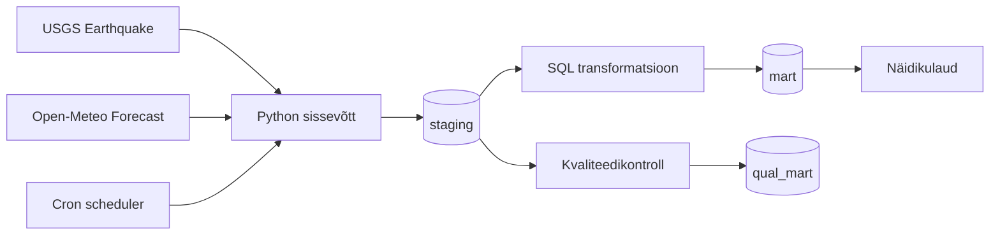

# GRUPP VÄRIN - VIIMASE_NÄDALA_MAAVÄRINATE_ÜLEVAADE

## Äriküsimus

Meie eesmärk on koondada maavärina andmed ühtsesse ülevaatesse, mis toetab teadlasi, kriisijuhtimist ja avalikkust ajakohase ohutaseme hindamisel ning varajase hoiatamise võimaluste parandamisel.

Millistes piirkondades on viimase nädala jooksul toimunud kõige rohkem reageerimist vajava ohutasemega maavärinaid ja kui tugevad/ulatuslikud need olid?

**Mõõdikud:**

1. Reageerimist vajava ohutasemega maavärinate arv viimasel nädalal
2. Maavärinate arv viimasel nädala nende tugevuse (magnituudi) grupi ja piirkonna järgi
3. Maavärinate ja reageerimist vajavate ohutasemetega maavärinate arv keskmiselt ühes nädalas kuude ja aastate lõikes.
4. Reageerimist vajava ohutasemega maavärina asukoha ilmainfo.

Täpsem info mõõdikute kohta koos arvutuskäiguga: [`docs/arhitektuur.md`](docs/arhitektuur.md)

## Arhitektuur



Täpsem kirjeldus: [`docs/arhitektuur.md`](docs/arhitektuur.md)

## Andmestik

| Allikas | Tüüp | Ajas muutuv? | Roll |
|---------|------|--------------|------|
| USGS Earthquake | API | Jah, osaliselt iga minut | Põhiandmevoog |
| Open Meteo Forecast | API | Jah, ... | Lisaandmevoog |


## Stack

| Komponent | Tööriist |
|-----------|---------|
| Sissevõtt | Python | 
| Transformatsioon | SQL, vajadusel dbt | 
| Andmehoidla | PostgreSQL (DuckDB kasutasime ühenduse testimiseks) |
| Näidikulaud | Superset |
| Orkestreerimine | cron |

## Käivitamine

```bash
# 1. Klooni repo ja liigu kausta
git clone https://github.com/MSocius/maavarinate-ulevaade-pss-ut-andmeinseneeria-2026
cd maavarinate-ulevaade-pss-ut-andmeinseneeria-2026
git pull

# 2. Kopeeri keskkonnamuutujad
cp .env.example .env
.env.example .env - on hetkel ka maavärinate spetsiifilised andmed, siis tulevad need "git pull" abil oma pc-sse

# 3. Käivita teenused
docker compose up -d --build
Loob järgmise keskkonna
> Image: uperset-import; superset; scheduler; superset-init
> Container: maavarin-db; maavarin-superset-init; maavarin-scheduler; maavarin-superset-import; maavarin-superset  

# 4. Käivita kõik tegevused ühe koodiga  
python aa_koik_jarjest.py
```
Näidikulaud: http://localhost:8088

## Saladused ja konfiguratsioon

Kõik saladused (paroolid, API võtmed, andmebaasi URL-id) on `.env` failis. Repos on ainult `.env.example`, mis näitab vajalike muutujate struktuuri ilma tegelike väärtusteta. Päris `.env` fail on `.gitignore`-s.

Vajalikud muutujad:

| Muutuja | Tähendus | Näide |
|---------|----------|-------|
| `USGS_URL` | maavärinate andmete asukoht | https://earthquake.usgs.gov/fdsnws/event/1/query |
| `POSTGRES_USER` | db kasutaja | (kasutaja) |
| `POSTGRES_PASSWORD` | parool | (parool) |
| `POSTGRES_DB` | db nimi | MAAVARIN_PG|
| `DB_PORT_HOST` | port | 55432 |
| `...` |  ... | ... |
| `OPENMETEO_BASE_URL` | ilmastiku andmete asukoht | https://archive-api.open-meteo.com/v1/archive |
| `SQL_KAUSTA_URL` | SQL transformatsioonid | earthquakes_alert_week.sql |
| `SUPERSET_PORT_HOST` | port | 8088 |
| `SUPERSET_SECRET_KEY` | keskkonna muutuja loomiseks  | SECRET_KEY |
| `SUPERSET_ADMIN_USER` | brauseris Superset-i logimine | (kasutaja) |
| `SUPERSET_ADMIN_PASSWORD` | brauseris Superset-i logimine | (parool) |
| `SUPERSET_ADMIN_EMAIL` |
| `...` |  ... | ... |


## Andmevoog lühidalt

1. **Sissevõtt** —  Pythoni script aa_koik_jarjest.py käivitab erinevad py-d
    > pg_ingest_usgs.py kraabib USGS API-st toorandmed. API lingi ja paroolid on env failis.
    > earthquakes_alert_week.sgl leiab viimase 7 päeva ja >= 5 magnituudiga
    > openmeteo_maav_ilm_tund.py kraabib 7 päeva ilmaandmed vastavalt koordinaadile OpenMeteo baasist (+/- 36 tundi).
3. **Laadimine** —  Andmed laetakse PostgreSQL andmebaasi. 
4. **Transformatsioon** — Magnituudi kategooriad:mikro — magnituud alla <2, väike 2 .. 4, mõõdukas = 4 .. 5, tugev = 6 .. 7, väga tugev st üle 7. Päeva kokkuvõte: piirkond ja magnituud vähemalt 4. Arvutused tuleb teha ka ajatunnusega (fail sisaldab Unix TimeStampi maavärina esmase registreerimise ja ka maavärina andmete täiendamise ajahetke kohta. Unix TimeStamp tuleb kindlasti loetavale kujule UTC-ks konvertida). Konvertida tuleb ka piirkonna tunnuseid suuremateks regioonideks.
6. **Kvaliteedikontroll** — Andmekvaliteedi testid kontrollivad andmete korrektsust ja loogilisust
7. **Näidikulaud** — Näidiklaud näitab esmalt reageerimist vajavaid maavärinaid (ohukategooria järgi), maavärinate üldarvu piirkonniti, tugevuse ja ohutaseme järgi ning üldist nädalate keskmist maavärinate arvu. Kui võimalik, kuvame piirkondliku info kaardil ja kasutame ohutaseme värviskaalat.

## Andmekvaliteedi testid
Kontrollime järgmisi näitajaid:
1. Kas maavärina registreering on db-s unikaalne (lisaks unikaalsele ID-d-le on igal kirjel ka unikaalne UnixTimeStamp tuhandik sekundi täpsusega - kontrollime mõlemat).
2. Kas iga maavärina kohta on märgitud ära meile vajalikud andmeväljad (piirkond, magnituud, ohuhinnang, timestamp, updated timestamp, koordinaadid jms)
3. Magintuudid ei ole negatiivse väärtusega
4. Konventeeritud UnixTimestamp annab tagasi UTC, mis on loogiline, st mahub viimase nädala/kuu sisse
5. Konveneeritud UnixTimeStamp ei ole tulevikus ega varasemas minevikus kui meie päritud andmed  

Testide tulemused salvestatakse eraldi andmebaasi **qual_mart**

## Projekti struktuur

```
.
├── README.md
├── compose.yml
├── .env.example
├── .gitignore
├── docs/
│   ├── arhitektuur.md      ← nädal 1 väljund
│   └── progress.md         ← nädal 2 väljund
└── ...                     ← ülejäänud projektifailid
```

## Kokkuvõte, puudused ja võimalikud edasiarendused

**Kokkuvõte:**
- GitHub-i Codespaces ja pc CMD`s töötab paralleeleselt. 
- Andmete laadimine andmebaasi töötab, samuti esimese päringu alusel tehtud järgmise andmeallika andmete pärimine toimib
- Liiga palju aega kulus seadistusele ja koodile:
  > paroolide ja kasutajanimede ülesseadmisel on vaja väga suurt täpsust (einevate failide koostööks),
  > mõnes koodis on tühi rida vajalik ja teises kohas ei ole lubatud,
  > jne
- Uute tarkvarade rakendamiseks jäi aega väheks.
- kohustuslikud projekti osad täidetud, kuid vilumust kõikide vajalike tarkvarade kasutamiseks ei tekkinud 

**Puudused:**
- Süsteemide loogika ja seadistustega on veel vaja katsetada. GitHubi Codespaces ei ole piisavat töökindlust. 
- Seadistused on algajale keerulised. Peamiselt kasutades Windowsi, siis hetkel on palju detaile, mis takistavad ja tekitavad segadust. Selle loogikaga vaja veel harjuda. 
- Selleks, et luua lahendus, mis oleks viimistletud ja valmis päriselt kasutusele võtmiseks, läheks kordades rohkem aega.

**Mis edasi:**
- mõned täiendkoolituses kasutatud programmid ja lähenemised on meile ka tööalaselt kasutatavad, neid tahaks uurida edasi ja kasutamise vilumust saada
- tahaks katsetada sarnasel moel endale või tööks kasulikke andmestikke kokku tuua Eesti avaandmete portaalist
- tahaks üsna tükk aega end enam mitte nii ebakompetentsena tunda :D:D

**Riskid ja nende maandamine:**

| jrk | Risk | Maandamine |
|---------|----------|-------|
| 1. | Projekt ei jõua õigeaegselt valmis (grupiliikmetel ei ole piisavalt aega/motivatsiooni/jaksu panustada, püütakse teha hästi palju või hästi põhjalikult, ei küsita abi või jäädakse oskamatuse tõttu hätta) | Lepime kokku miinimum versiooni projektist, mis kindlasti ettenähtud ajaga ellu viiakse. Nice-to-have osad, mis võivad olla põnevad või arendavad, võtame tegeleda siis kui miinimum on tehtud. Hoiame omavahel ühendust, lepime kokku ühised aruteluajad, sh mentoriga. Hoiame avatud suhtlusstiili ja tunnistame kui ei oska või mõni nädal ei jõua panustada.|
| 2. | Kõiki vajalikke tarkvarasid ei õnnestu omavahel koos toimima saada nii, et andmetorud, andmekontrollid ja visuaalid toimiksid veavabalt. | Küsime nõu, arutame teiste kursusel osalejatega, googeldame ja kasutame nõu saamiseks tehisintellekti abi. Ei üritada maailma parimat lahendust luua, vaid keskendume kõige olulisemale. Kui vaja, valime tööks tarkvarad, mida loengus ja praktikumides õpetati. |
| 3. | Reageerimist vajavaid maavärinaid toimub nii harva ja nii erinevais paigus, et meie loodud juhtimislaua abil ei ole tegelikult võimalik äriküsimustes viidatud probleeme lahendada ja kiiremini, teadlikumalt ohust teavitada, kriise juhtida jms | Kaks valikut: a) Kirjeldame lahti, milliseid tugisüsteeme oleks veel lisaks meie lahendusele luua, et kokkupandavast infost oleks abi  või b) sõnastame äriküsimuse ümber, jätame alles ainult ühe kasusaaja või kitsendame maavärinate piirkondi, nii et oleks võimalik teavitussüsteem ja/või kriisijuhtimine sellele väljundile tuginevalt üles ehitada.
| 4. | Me ei suuda saadud andmeid korrektselt tõlgendada ega vajalikke transformatsioone ja andmekontrolle teha, kuna meil ei ole selle valdkonna tausta. | Toetume USGS veebilehel juba välja antud statistikale ja liigitustele. Loeme USGS lehel olevaid ülevaateid ja uudisnupukesi, et mitte põhiinfoga eksida. Loeme põhjalikult läbi USGS lehel oleva API kirjelduse ja  metaandmete kirjeldused. Arutame omavahel läbi, kas saime kõik andmetest sama moodi aru. |
| ... |  ... | ... |


## Meeskond

| Nimi | Roll |
|------|------|
| Katre Seema | Riskid, andmekontrollide ja -teisenduste kirjeldamine, arhitektuuripildi ja dokumentatsiooni viimislemine|
| Margus Soots | REPO omanik, andmeallikate liidestamine, pytoni ja SQL koodid, näidikulaua tarkvara ühenduvus, kooditäiendused ja automatiseerimine |
