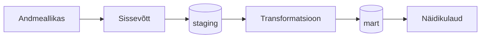

# GRUPP VÄRIN — VIIMASE_NÄDALA_MAAVÄRINATE_ÜLEVAADE

## Äriküsimus

Meie eesmärk on koondada maavärinaandmed ühtsesse ülevaatesse, mis toetab teadlasi, kriisijuhtimist ja avalikkust ajakohase ohutaseme hindamisel ning varajase hoiatamise võimaluste parandamisel.

**Mõõdikud:**

1. Reageerimist vajava ohutasemega maavärinate arv viimasel nädalal
2. Maavärinate arv viimasel nädala nende tugevuse (magnituudi) grupi ja piirkonna järgi
3. Maavärinate ja reageerimist vajavate ohutasemetega maavärinate arv keskmiselt ühes nädalas kuude ja aastate lõikes.

   VÕIMALIK. ET TÄIENDAME 

## Arhitektuur



Täpsem kirjeldus: [`docs/arhitektuur.md`](docs/arhitektuur.md)

TEEMA ON VEEL LAHTINE

## Andmestik

| Allikas | Tüüp | Ajas muutuv? | Roll |
|---------|------|--------------|------|
| USGS Earthquake | API | Jah, osaliselt iga minut | Põhiandmevoog |
| [Earthquake Track] | [seed / dim-tabel] | Ei, staatiline | Kõrvaltabel |
VÕIMALIK. ET TÄIENDAME 

## Stack

| Komponent | Tööriist |
|-----------|---------|
| Sissevõtt | Python | 
| Transformatsioon | SQL, vajadusel dbt | 
| Andmehoidla | PostgreSQL (DuckDB kasutasime ühenduse testimiseks) |
| Näidikulaud | [Superset / Streamlit / muu] |
| Orkestreerimine | [Airflow / cron / muu] |

## Käivitamine

```bash
# 1. Klooni repo ja liigu kausta
git clone <repo-url>
cd <projekti-kaust>

git clone https://github.com/MSocius/maavarinate-ulevaade-pss-ut-andmeinseneeria-2026
cd maavarinate-ulevaade-pss-ut-andmeinseneeria-2026
git pull


# 2. Kopeeri keskkonnamuutujad
cp .env.example .env
# Muuda .env failis paroolid ja muud seaded vastavalt vajadusele
.env.example .env - on hetkel ka maavärinate spetsiifilised andmed, siis tulevad need "git pull" abil oma pc-sse
.env - ei tohi jõuda reposse.

# 3. Käivita teenused
docker compose up -d --build

MS - mina kasutan CMD
git pull - tõmbab repo uuendused oma pc-sse
pip install duckdb - paigaldab andmebaasi. Võiks paigaldada prosgre selle asemel
python ingest_usgs.py - kood leiab env failist muutujad ja salvestab ducdb andmebaasi

# 4. [Vabatahtlik: käivita sissevõtt käsitsi esimesel korral]
# docker compose exec pipeline python scripts/run_pipeline.py run-all
```

Airflow (kui kasutatakse): http://localhost:8080 (kasutaja: airflow / parool: airflow)
Näidikulaud: http://localhost:[PORT]

## Saladused ja konfiguratsioon

Kõik saladused (paroolid, API võtmed, andmebaasi URL-id) on `.env` failis. Repos on ainult `.env.example`, mis näitab vajalike muutujate struktuuri ilma tegelike väärtusteta. Päris `.env` faili ei tohi GitHubi panna - see on `.gitignore`-s.

Vajalikud muutujad:

| Muutuja | Tähendus | Näide |
|---------|----------|-------|
| `USGS_URL` | andmete asukoht | https://earthquake.usgs.gov/fdsnws/event/1/query |
| `POSTGRES_USER` | db kasutaja | meiegrupp |
| `POSTGRES_PASSWORD` | parool | meieparool |
| `POSTGRES_DB` | db nimi | MAAVARIN_PG|
| `DB_PORT_HOST` | port | 55432 |
| `...` |  ... | ... |
VÕIMALIK. ET TÄIENDAME 


## Andmevoog lühidalt

1. **Sissevõtt** —  Py script ingest_usgs.py kraabib USGS API-st toorandmed. API lingi ja paroolid on env failis.
2. **Laadimine** —  Andmed laetakse PostgreSQL andmebaasi (andmete kättesaadavust testisime ka DuckDB-ga). 
3. **Transformatsioon** — Magnituudi kategooriad:mikro — magnituud alla <2, väike 2 .. 4, mõõdukas = 4 .. 6, tugev = 6 .. 7, väga tugev st üle 7. Päeva kokkuvõte: piirkond ja magnituud vähemalt 4. Arvutused tuleb teha ka ajatunnusega (fail sisaldab Unix TimeStampi maavärina esmase registreerimise ja ka maavärina andmete täiendamise ajahetke kohta. Unix TimeStamp tuleb kindlasti loetavale kujule UTC-ks konvertida). Konvertida tuleb ka piirkonna tunnuseid suuremateks regioonideks.
6. **Testimine** — [Mitu] andmekvaliteedi testid kontrollivad andmete korrektsust ja loogilisust
7. **Näidikulaud** — Näidiklaud näitab esmalt reageerimist vajavaid maavärinaid (ohukategooria järgi), maavärinate üldarvu piirkonniti, tugevuse ja ohutaseme järgi ning üldist nädalate keskmist maavärinate arvu. Kui võimalik, kuvame piirkondliku info kaardil ja kasutame ohutaseme värviskaalat.
VÕIMALIK. ET TÄIENDAME 

## Andmekvaliteedi testid

Projekt kontrollib järgmist:

1. Kas maavärina registreering on db-s unikaalne (lisaks unikaalsele ID-d-le on igal kirjel ka unikaalne UnixTimeStamp tuhandik sekundi täpsusega - kontrollime mõlemat).
2. Kas iga maavärina kohta on märgitud ära meile vajalikud andmeväljad (piirkond, magnituud, ohuhinnang, timestamp, updated timestamp, koordinaadid jms)
3. Magintuudid ei ole negatiivse väärtusega
4. Konventeeritud UnixTimestamp annab tagasi UTC, mis on loogiline, st mahub viimase nädala/kuu sisse
5. Konveneeritud UnixTimeStamp ei ole tulevikus ega varasemas minevikus kui meie päritud andmed  
LISAME TESTE KUI OLEME ANDMETEGA ROHKEM TÖÖD TEINUD 

Testide tulemused: [kuhu salvestatakse / kuidas vaadata]

## Projekti struktuur

```
.
├── README.md
├── compose.yml
├── .env.example
├── .gitignore
├── docs/
│   ├── arhitektuur.md      ← nädal 1 väljund
│   └── progress.md         ← nädal 2 väljund
└── ...                     ← ülejäänud projektifailid
```

## Kokkuvõte, puudused ja võimalikud edasiarendused

**Kokkuvõte:**
- [Loetle, mis on lõpule viidud, mis töötab hästi]
- GitHub-i Codespaces ja pc CMD`s töötab paralleeleselt. 
- Andmete laadimine andmebaasi töötab.
- 2026.a maikuu kõikide registreeritud maavärinate andmed on alla laetud, et uurida andmekoosseise, andmete vormingut, puuduvaid väärtusi jms teisendamiseks ja andmekontrollideks vajalikku infot.
- Grupp suhtleb omavahel grupivestluses, iga grupiliige on "toru võtnud".
- 

**Puudused:**
- [Loetle ausalt, mis jäi tegemata - see ei mõjuta hinnet negatiivselt, vaid aitab hinnata]
- Süsteemide loogika ja seadistustega on veel vaja katsetada. GitHubi Codespaces ei ole piisavat töökindlust. 
- Seadistused on algajale keerulised. Peamiselt kasutades Windowsi, siis hetkel on palju detaile mis takistavad ja tekitavad segadust. Selle loogikaga vaja veel harjuda. 
- Projektiplaani, ideid, rolle ja lahendusi ei ole saanud grupiga koos läbi arutada
- 

**Mis edasi:**
- [Mida tahaksid edasi teha, kui aega oleks rohkem]
- Andmeallikaid oleks juurde vaja integreerida.
- Ajaloolisi maavärinate andmeid tuleb veel veidi uurida, et teaks täpsemalt, millised andmekontrolle, transformatsioone ja juhtimislaudu teha, et äriküsimusele võimalikult hästi vastata.
- Praegu valisime mõõdikud äriprobleemi järgi, kuid peab vaatama, et me päris sama väljundit looma ei hakkaks, mis USGS lehel juba olemas on :)
- Peaks tegema ühise grupikohtumise, et projektiplaan läbi arutada, praegu toimetame asünkroonselt
- Põnev oleks jah, andmeid mõne teise andmeallikaga siduda, et saaks tekkida uut teadmist, mitte lihtsalt statistiline ülevaade

**Riskid ja nende maandamine:**

| jrk | Risk | Maandamine |
|---------|----------|-------|
| 1. | Projekt ei jõua õigeaegselt valmis (grupiliikmetel ei ole piisavalt aega/motivatsiooni/jaksu panustada, püütakse teha hästi palju või hästi põhjalikult, ei küsita abi või jäädakse oskamatuse tõttu hätta) | Lepime kokku miinimum versiooni projektist, mis kindlasti ettenähtud ajaga ellu viiakse. Nice-to-have osad, mis võivad olla põnevad või arendavad, võtame tegeleda siis kui miinimum on tehtud. Hoiame grupiga ühendust, lepime kokku ühised aruteluajad, sh mentoriga. Hoiame avatud suhtlusstiili ja tunnistame kui ei oska või mõni nädal ei jõua panustada. |
| 2. | Kõiki vajalikke tarkvarasid ei õnnestu omavahel koos toimima saada nii, et andmetorud, andmekontrollid ja visuaalid toimiksid veavabalt. | Küsime nõu, arutame teiste kursusel osalejatega, googeldame ja kasutame nõu saamiseks tehisintellekti abi. Ei üritada maailma parimat lahendust luua, vaid keskendume kõige olulisemale. Kui vaja, valime tööks tarkvarad, mida loengus ja praktikumides õpetati. |
| 3. | Reageerimist vajavaid maavärinaid toimub nii harva ja nii erinevais paigus, et meie loodud juhtimislaua abil ei ole tegelikult võimalik äriküsimustes viidatud probleeme lahendada ja kiiremini, teadlikumalt ohust teavitada, kriise juhtida jms | Kaks valikut: a) Kirjeldame lahti, milliseid tugisüsteeme oleks veel lisaks meie lahendusele luua, et kokkupandavast infost oleks abi  või b) sõnastame äriküsimuse ümber, jätame alles ainult ühe kasusaaja või kitsendame maavärinate piirkondi, nii et oleks võimalik teavitussüsteem ja/või kriisijuhtimine sellele väljundile tuginevalt üles ehitada.
| 4. | Me ei suuda saadud andmeid korrektselt tõlgendada ega vajalikke transformatsioone ja andmekontrolle teha, kuna meil ei ole selle valdkonna tausta. | Toetume USGS veebilehel juba välja antud statistikale ja liigitustele. Loeme USGS lehel olevaid ülevaateid ja uudisnupukesi, et mitte põhiinfoga eksida. Loeme põhjalikult läbi USGS lehel oleva API kirjelduse ja  metaandmete kirjeldused. Arutame omavahel läbi, kas saime kõik andmetest sama moodi aru. |
| ... |  ... | ... |


## Meeskond

| Nimi | Roll |
|------|------|
| Ingrid Puusta-Rickard | arhitektuur |
| Katre Seema | Riskid, andmekontrollid ja -teisendused|
| Margus Soots | andmeallika, transformatsioonide, näidikulaua omanik |
