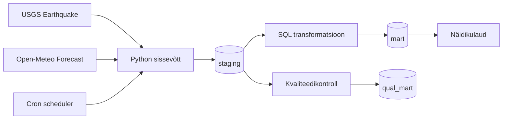

# Arhitektuur

## Äriküsimus

Meie eesmärk on koondada maavärina andmed ühtsesse ülevaatesse, mis toetab teadlasi, kriisijuhtimist ja avalikkust ajakohase ohutaseme hindamisel ning varajase hoiatamise võimaluste parandamisel.

Millistes piirkondades on viimase nädala jooksul toimunud kõige rohkem reageerimist vajava ohutasemega maavärinaid ja kui tugevad/ulatuslikud need olid? 

## Mõõdikud

1. **Reageerimist vajava ohutasemega maavärinate arv viimasel nädalal** - filtreerime välja kõrge ohutasemega maavärina teated,  loendame ja kuvame välja viimase nädala üldarvu
2. **Maavärinate arv viimasel nädala nende tugevuse (magnituudi) grupi ja piirkonna järgi** - loendame kokku kõik registreeritud maavärinateated, rühmitame neid piirkonna ja tugevuse järgi. Kuvame välja viimase nädala üldarvud koos osakaaludega  %-des. (et oleks näha kui suur osa kõikidest registreeritud maavärinatest on mingi ohutasemega, mingis piirkonnas või mingis tugevusgrupis)
4. **Maavärinate ja reageerimist vajavate ohutasemetega maavärinate arv keskmiselt ühes nädalas kuude ja aastate lõikes** - loendame pikema perioodi andmete alusel kokku maavärinate ja reageerimist vajava ohutasemega maavärinate arvud, arvutame nädalate kohta välja koondnäitajad, arvutame nädalate keskmised, kuvame nädalate keskmised välja sagedusdiagrammina (et oleks näha, kas kõrgema tasemega või üldse maavärinad on sesoonsed näitajad ning millised kuud võiksid olla "ohtlikumad" ning et hinnata, kas käesolev nädal on nö "kesmine nädal", "seismiliselt väga aktiivne nädal" või "üsna rahulik nädal" - loob natuke rohkem konteksti kui lihtsalt nädala üldarv)  

## Andmeallikad

| Allikas | Tüüp | Ajas muutuv? | Roll |
|---------|------|--------------|------|
| USGS Earthquake | API | Jah, osaliselt iga minut | Põhiandmevoog, registreeritud maavärinad |
| Opem Meteo Forecast| API | Jah, [iga X tundi / päeva]  | Lisaandmevoog, põhiandmevoo piirkonna ilmainfo |

## Andmevoog

## Andmebaasi kihid

| Allikas | Tüüp | Ajas muutuv? | Roll |
|---------|------|--------------|------|
|staging| lametabelid | jah, tabelisse tuleb kirjeid juurde | Transformeerimata andmestikud|
|mart| dimensionaalne mudel, tähtskeem |dimensioonid ei muutu, faktitabelite sisu muutub| Transformeeritud andmestikud|
|qual_mart| lametabelid |jah, iga käivitamisega kirjutatakse tulemus üle| Kvaliteeditestide tulemused|

## Tööjaotus

| Roll | Vastutus | Täitja |
|------|----------|--------|
| Andmeallika omanik | Kirjutab sissevõtu loogika, hoiab API-t töös | Margus |
| Transformatsioonide omanik | Kirjutab mart kihi mudelid ja mõõdikute arvutuse | [Nimi] |
| Arhitektuuripilt | Loob arhitektuuriskeemi | Katre |
| Kvaliteedi omanik | Kirjutab testid ja vaatab läbi ebaõnnestunud kontrollid | Katre |
| Näidikulaua omanik | Ehitab näidikulaua ja seob selle äriküsimusega | [Nimi] |

## Riskid

| jrk | Risk | Maandamine |
|---------|----------|-------|
| 1. | Projekt ei jõua õigeaegselt valmis (grupiliikmetel ei ole piisavalt aega/motivatsiooni/jaksu panustada, püütakse teha hästi palju või hästi põhjalikult, ei küsita abi või jäädakse oskamatuse tõttu hätta) | Lepime kokku miinimum versiooni projektist, mis kindlasti ettenähtud ajaga ellu viiakse. Nice-to-have osad, mis võivad olla põnevad või arendavad, võtame tegeleda siis kui miinimum on tehtud. Hoiame grupiga ühendust, lepime kokku ühised aruteluajad, sh mentoriga. Hoiame avatud suhtlusstiili ja tunnistame kui ei oska või mõni nädal ei jõua panustada. |
| 2. | Kõiki vajalikke tarkvarasid ei õnnestu omavahel koos toimima saada nii, et andmetorud, andmekontrollid ja visuaalid toimiksid veavabalt. | Küsime nõu, arutame teiste kursusel osalejatega, googeldame ja kasutame nõu saamiseks tehisintellekti abi. Ei üritada maailma parimat lahendust luua, vaid keskendume kõige olulisemale. Kui vaja, valime tööks tarkvarad, mida loengus ja praktikumides õpetati. |
| 3. | Reageerimist vajavaid maavärinaid toimub nii harva ja nii erinevais paigus, et meie loodud juhtimislaua abil ei ole tegelikult võimalik äriküsimustes viidatud probleeme lahendada ja kiiremini, teadlikumalt ohust teavitada, kriise juhtida jms | Kaks valikut: a) Kirjeldame lahti, milliseid tugisüsteeme oleks veel lisaks meie lahendusele luua, et kokkupandavast infost oleks abi  või b) sõnastame äriküsimuse ümber, jätame alles ainult ühe kasusaaja või kitsendame maavärinate piirkondi, nii et oleks võimalik teavitussüsteem ja/või kriisijuhtimine sellele väljundile tuginevalt üles ehitada.
| 4. | Me ei suuda saadud andmeid korrektselt tõlgendada ega vajalikke transformatsioone ja andmekontrolle teha, kuna meil ei ole selle valdkonna tausta. | Toetume USGS veebilehel juba välja antud statistikale ja liigitustele. Loeme USGS lehel olevaid ülevaateid ja uudisnupukesi, et mitte põhiinfoga eksida. Loeme põhjalikult läbi USGS lehel oleva API kirjelduse ja  metaandmete kirjeldused. Arutame omavahel läbi, kas saime kõik andmetest sama moodi aru. |
| ... |  ... | ... |

## Privaatsus ja turve

Projekti andmete hulgas ei ole isikustatud adnmeid. Andmete juhtimislaual kasutatakse registreeritud maavärinate andmeid ( tugevus, asukoht, ohutase, koordinaadid, sügavus, kellaaeg) ning sama piirkonna ilmastiku andmeid (temperatuur, sademed, tuule tugevus ja suund). Andmebaasi kasutajanimi ja parool tulevad .env failist. Repo on piiratud kasutamisõigusega, ligipääs grupiliikmetele ja juhendajatele.
